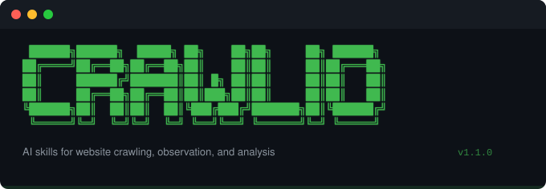

<p align="center">
  
</p>

<p align="center">
  <a href="https://github.com/Crawlio-app/crawlio-plugin/releases"></a>
  <a href="LICENSE"></a>
  <a href="https://agentskills.io"></a>
  <a href="https://crawlio.app"></a>
</p>

<p align="center">
  Give any AI agent the ability to crawl, observe, and analyze websites.
</p>

---

5 skills, 1 agent, and an MCP server — packaged as a plugin that follows the [Agent Skills](https://agentskills.io) open standard. The skills are plain Markdown files that encode domain judgment: when to use which settings, how to interpret observations, what constitutes a finding. The plugin format is just the distribution mechanism.

## Table of Contents

- [Prerequisites](#prerequisites)
- [Setup](#setup)
- [Skills](#skills)
- [Agent](#agent)
- [How It Works](#how-it-works)
- [Forking](#forking)
- [License](#license)

## Prerequisites

| Requirement | Description |
|-------------|-------------|
| **Crawlio** | macOS app, installed and running — [download](https://crawlio.app) |
| **CrawlioMCP** | MCP server binary (see below) |
| **AI tool** | Any tool with MCP support (Claude Code, Gemini CLI, Cursor, Windsurf, etc.) |

### Build CrawlioMCP

```bash
cd /path/to/Crawlio-app
swift build -c release --product CrawlioMCP
```

Binary lands at `.build/release/CrawlioMCP`.

## Setup

### Install

**Claude Code** — plugin install:

```bash
claude plugin install /path/to/crawlio-plugin
```

**Gemini CLI** — add to your [MCP server config](https://geminicli.com/docs/tools/mcp-server/):

```json
{
  "mcpServers": {
    "crawlio": {
      "command": "CrawlioMCP"
    }
  }
}
```

**Other MCP clients** (Cursor, Windsurf, etc.) — copy the `.mcp.json` contents into your client's MCP config. The skills in `skills/` work as standalone Markdown instructions in any agent that supports them.

### Make CrawlioMCP available in PATH

```bash
ln -sf /path/to/Crawlio-app/.build/release/CrawlioMCP /usr/local/bin/CrawlioMCP
```

Or edit `.mcp.json` to use a full path:

```json
{
  "mcpServers": {
    "crawlio": {
      "command": "/path/to/Crawlio-app/.build/release/CrawlioMCP"
    }
  }
}
```

### Start Crawlio

Launch the Crawlio macOS app. It starts a local HTTP control server automatically.

## Skills

| Skill | Description |
|-------|-------------|
| [`crawl-site`](#crawliocrawl-site) | Crawl with intelligent config, monitoring, and retry |
| [`extract-and-export`](#crawlioextract-and-export) | Full pipeline: crawl, extract, export in 7 formats |
| [`observe`](#crawlioobserve) | Query the observation timeline with filters |
| [`finding`](#crawliofinding) | Create and query evidence-backed findings |
| [`audit-site`](#crawlioaudit-site) | Multi-pass site audit with findings report |

### `/crawlio:crawl-site`

Crawl a website with intelligent configuration. Detects site type (static, SPA, CMS, docs), optimizes settings, monitors progress, retries failures, and reports results.

```
/crawlio:crawl-site https://example.com
```

### `/crawlio:extract-and-export`

End-to-end pipeline: crawl a site, extract structured content (clean HTML, markdown, metadata), and export in any of 7 formats.

```
/crawlio:extract-and-export https://docs.stripe.com 5 warc
```

Supported formats: `folder` `zip` `singleHTML` `warc` `pdf` `extracted` `deploy`

### `/crawlio:observe`

Query the observation log — the append-only timeline of everything Crawlio saw during a crawl. Filter by host, source, operation type, or time range.

```
/crawlio:observe example.com
```

### `/crawlio:finding`

Create and query evidence-backed findings. Record insights with observation IDs as evidence that persist across sessions.

```
/crawlio:finding
```

### `/crawlio:audit-site`

Full site audit: crawl, capture enrichment, analyze observations across multiple passes, and produce a findings report with prioritized recommendations.

```
/crawlio:audit-site https://example.com
```

## Agent

### Site Auditor

A custom agent (`agents/site-auditor.md`) for systematic multi-pass site analysis:

1. **Reconnaissance** — detect site type, configure settings
2. **Crawl** — download with monitoring and failure retry
3. **Analysis** — structure, errors, enrichment, synthesis (4 passes)
4. **Report** — evidence-backed findings with prioritized recommendations

## How It Works

```
AI Agent  ──skill──►  CrawlioMCP  ──HTTP──►  Crawlio App
                      (stdio MCP)             (macOS, 127.0.0.1)
                           │
                           ▼
                      observations.jsonl
                      (per-project timeline)
```

**Skills** encode *judgment* — when to use which settings, how to interpret observations, what constitutes a finding.

**MCP server** handles *mechanics* — HTTP calls, file reads, protocol bridging.

This separation is what makes the plugin forkable: swap the judgment layer for your domain, keep the same mechanics.

### Optional: Chrome Extension

For deeper analysis, install the [Crawlio Agent](https://github.com/crawlio/crawlio-agent) Chrome extension. It captures browser-side intelligence (framework detection, network requests, console logs, DOM snapshots) that enriches the observation log.

## Forking

This plugin is designed to be forked. See [FORKING.md](FORKING.md) for a guide on creating domain-specific versions:

- **SEO Auditor** — meta tags, heading hierarchy, structured data, internal linking
- **Security Scanner** — HTTPS enforcement, security headers, exposed endpoints
- **Competitive Analysis** — multi-site framework comparison, third-party services
- **Content Migration Planner** — URL mapping, redirect chains, content volume

## License

[MIT](LICENSE)
