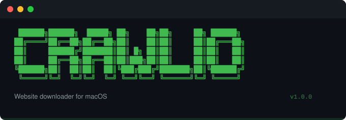

<p align="center">
  
</p>

<p align="center">
  <a href="https://github.com/Crawlio-app/crawlio-plugin/releases"></a>
  <a href="LICENSE"></a>
  <a href="https://agentskills.io"></a>
  <a href="https://crawlio.app"></a>
</p>

---

Crawl, reverse-engineer, and analyze any website from your AI agent.

10 skills. 1 agent. One MCP server behind all of it.

## Install

```bash
claude plugin install github:Crawlio-app/crawlio-plugin
```

Or add the server directly to any MCP client:

```json
{
  "mcpServers": {
    "crawlio": {
      "command": "npx",
      "args": ["-y", "@crawlio/mcp@latest"]
    }
  }
}
```

Works with Claude Code, Gemini CLI, Cursor, Windsurf. Anything that speaks MCP.

No build step. No binary. `npx` handles it.

## Skills

| Skill | What it does |
|-------|-------------|
| [`crawlio-mcp`](skills/crawlio-mcp) | Entry point. Explains the server, routes you to the right skill |
| [`crawl-site`](skills/crawl-site) | Crawl with config, monitoring, and retry |
| [`extract-and-export`](skills/extract-and-export) | Crawl, extract, export. 7 formats |
| [`observe`](skills/observe) | Query the observation timeline |
| [`finding`](skills/finding) | Create and query evidence-backed findings |
| [`audit-site`](skills/audit-site) | Multi-pass site audit with findings report |
| [`web-research`](skills/web-research) | Structured acquire, normalize, analyze pipeline |
| [`decompile-spa`](skills/decompile-spa) | Reverse-engineer an SPA: modules, routes, state |
| [`extract-secrets`](skills/extract-secrets) | Scan JS bundles for hardcoded credentials. Authorized targets only |
| [`design-system`](skills/design-system) | Extract design tokens from a live page. Colors, type, spacing, breakpoints |

Skills are plain Markdown. The MCP server does the work.

## Agent

**Site Auditor** — four passes. Recon, crawl, analyze, report. Evidence-backed findings with prioritized fixes.

See [`agents/site-auditor.md`](agents/site-auditor.md).

## Architecture

```
Your AI agent
    │
    ▼
@crawlio/mcp  ─────►  5 abstract tools
(aggregator)           discover / call / do / cortex / consult
    │
    ├── chrome           browser extension, live context
    ├── headless         crawlio-agent-headless, RE skills
    ├── app              Crawlio.app, persistent projects
    └── headless-engine  fallback, zero dependencies
```

Skills reference concrete tool names. The aggregator routes them to the right pillar. Add a pillar, every skill gets the upgrade. No plugin release needed.

[Crawlio.app](https://crawlio.app) adds persistent projects and the full UI. Without it, the aggregator falls back to headless-engine. Crawling still works. Projects live in memory instead of on disk.

The [Chrome extension](https://github.com/Crawlio-app/crawlio-agent) adds live browser context: framework detection, network interception, console logs. Without it, those skills fall back to headless Chromium.

Both optional. The server runs either way.

## Structure

```
crawlio-plugin/
├── .claude-plugin/
│   └── plugin.json
├── .mcp.json
├── skills/
│   ├── crawlio-mcp/
│   ├── crawl-site/
│   ├── extract-and-export/
│   ├── observe/
│   ├── finding/
│   ├── audit-site/
│   ├── web-research/
│   ├── decompile-spa/
│   ├── extract-secrets/
│   └── design-system/
├── agents/
│   └── site-auditor.md
├── FORKING.md
└── LICENSE
```

Each skill is a single `SKILL.md` inside its directory. Each file follows the [Agent Skills](https://agentskills.io) open standard.

## Fork it

This plugin is designed to be copied.

SEO auditor. Security scanner. Competitive teardown. Content migration planner. Pick a domain, keep the tools, rewrite the skills.

See [FORKING.md](FORKING.md).

## License

[MIT](LICENSE)
